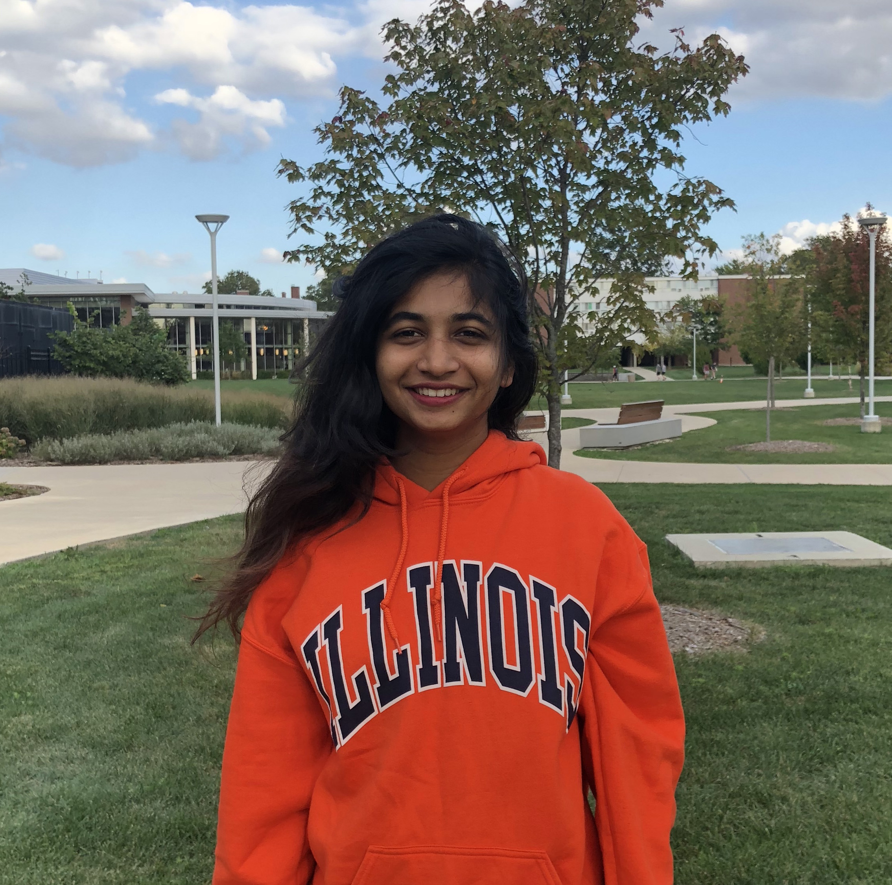

<table cellspacing="0" cellpadding="0">
<tr>

<strong>Sangjin Kim</strong>

</tr>
<tr>
<td width="150">
  
</td>
<td>
  Assistant Professor of Physics (2019-) <a href="https://physics.illinois.edu/people/directory/profile/sangjin" target="_blank">[minibio]</a>
   A member of NSF Center for <a href="https://cplc.illinois.edu" target="_blank">Physics of Living Cells</a>
   Faculty Affiliate in Biocomplexity Theme, Carl R. Woese Institute for Genomic Biology
   sangjin@illinois
</td></tr>
</table>
 
<table border="0" cellspacing="0" cellpadding="0">
<tr border="0">

<strong>Seunghyeon Kim</strong>

</tr>
<tr border="0">
<td width="150">
</td>
<td>
  Postdoctoral Associate
   colikim@illinois
</td>
</tr>
</table>
 
<table border="0" cellspacing="0" cellpadding="0">
<tr border="0">

<strong>Albur Hassan</strong>

</tr>
<tr border="0">
<td width="150">
</td>
<td>
  Graduate student (Physics)
   ahassan4@illinois
</td>
</tr>
</table>
 
<table border="0" cellspacing="0" cellpadding="0">
<tr border="0">

<strong>Laura Troyer</strong>
                                                                                                                                                                 </tr>
<tr border="0">
<td width="150">
  
</td>
<td>
  Graduate student (Physics)                                                                                                                                                                          ltroyer2@illinois                                                                                                                                                                          </td>
</tr>
</table>
 
<table border="0" cellspacing="0" cellpadding="0">
<tr border="0">

<strong>Ethan Muchnik</strong>

</tr>
<tr border="0">
<td width="150">
  
</td>
<td>
  Undergraduate student (Physics)
   emuchni2@illinois
</td>
</tr>
</table>
 
<table border="0" cellspacing="0" cellpadding="0">
<tr border="0"> 

<strong>Kavya Vaidya</strong>

</tr>
<tr border="0">
<td width="150">
  
</td>
<td>
  Undergraduate student (Physics)
   kvaidya2@illinois
</td>
</tr>
</table>
 
  <header class="post-header">
    <h1 class="post-title">alumni</h1>
    <h5 class="post-description"></h5>
  </header>
<table border="0" cellspacing="0" cellpadding="0">
<tr>
  
<strong>Zichen Zach Wang</strong>
 
  - Undergraduate student, MCB and physics, 2019-2020
</tr>
</table>
